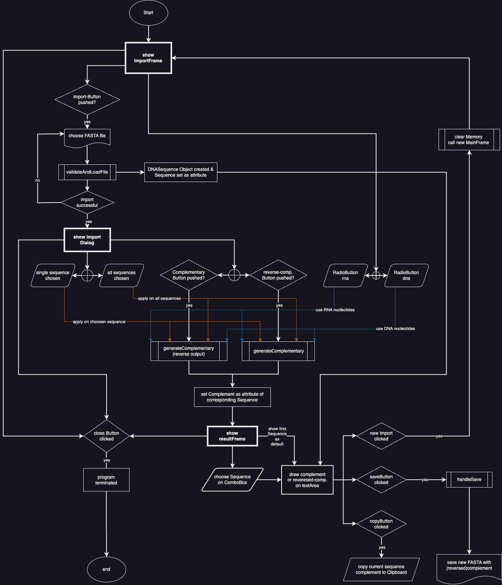

# DNA / RNA complement computation App with FASTA input

(note that most of the functions have a hyperLink referring to the implementation inside the Code!)

## App principle
This App takes a FASTA file as its input and will generate the complement or 
reverse-complement based on the users request.

The App is Ordered in three Layers:

### 0) Frame handling
all Frames are managed via the [`Main`](https://github.com/AbUndMax/DNA-Complementary-App/blob/a44164e1782119c641f518ea78161300baf105e3/Main/DNAComplementApp/Main.java)
file. All instances of frames are created there so each class is theoretical capable of accessing each frame and perform
actions on it. This is important for closing or opening new frames from different files without mixing the frame instances
and loosing access to them.
There are three frames:  
1) [`ImportFrame`:](https://github.com/AbUndMax/DNA-Complementary-App/blob/a44164e1782119c641f518ea78161300baf105e3/Main/DNAComplementApp/ImportFrame/ImportFrame.java)

2) [`ImportSuccessDialog`:](https://github.com/AbUndMax/DNA-Complementary-App/blob/a44164e1782119c641f518ea78161300baf105e3/Main/DNAComplementApp/ImportSuccessDialog/ImportSuccessDialog.java)

3) [`ResultFrame`:](https://github.com/AbUndMax/DNA-Complementary-App/blob/a44164e1782119c641f518ea78161300baf105e3/Main/DNAComplementApp/ResultFrame/ResultFrame.java)


### 1) import of a FASTA file
this is done inside the [`importFrame`](https://github.com/AbUndMax/DNA-Complementary-App/blob/a44164e1782119c641f518ea78161300baf105e3/Main/DNAComplementApp/ImportFrame/ImportFrame.java).
The user will be asked to provide a FASTA file.
Two RadioButtons allow the user to switch between DNA and RNA Sequence. A press 
on the import-Button opens the File Chooser. Has the user found its file and clicked
on OK. The Method [`ImportFrame.Handlers.ImportHandler.handleImport`](https://github.com/AbUndMax/DNA-Complementary-App/blob/a44164e1782119c641f518ea78161300baf105e3/Main/DNAComplementApp/ImportFrame/Handlers/ImportHandler.java#L14) 
gets called. which loads the File into the System.

The Loading is achieved inside [`ImportFrame.Handlers.ImportHandler.validateAndLoadFile`](https://github.com/AbUndMax/DNA-Complementary-App/blob/a44164e1782119c641f518ea78161300baf105e3/Main/DNAComplementApp/ImportFrame/Handlers/ImportHandler.java#L55-L95)
(see "Explanation of the three most significant functions")

### 2) Complementary or reverse-complementary?
If the import was a success, a [Dialog](https://github.com/AbUndMax/DNA-Complementary-App/blob/a44164e1782119c641f518ea78161300baf105e3/Main/DNAComplementApp/ImportSuccessDialog/ImportSuccessDialog.java) 
pops up, informing the user on the successful import. Furthermore, the Dialog shows two buttons which allows the user
to decide rather to get the complement or the reverse-complement of the chosen Sequence.
In the middle, a ComboBox is placed. All Sequences that where detected in the import phase will be displayed here.
two option are possible:

 - 1) "All" - which will then get the (reverse-) complement of all sequences in the file.
 - 2) a single sequence (chosen by clicking on the corresponding name)

the selection is stored inside an String-Array [`selectedSequences`](https://github.com/AbUndMax/DNA-Complementary-App/blob/a44164e1782119c641f518ea78161300baf105e3/Main/DNAComplementApp/ImportSuccessDialog/Listeners/ImportSeqChooserCBoxListener.java#L11).
This Array is used in multiple scenarios for getting the selectedSequences, loop over them and perform operations on
these Sequences. ("All" is selected by default)

If one of the Buttons is pressed the ImportFrame and the ImportDialog are disposed and the [`ResultFRame`](https://github.com/AbUndMax/DNA-Complementary-App/blob/a44164e1782119c641f518ea78161300baf105e3/Main/DNAComplementApp/ResultFrame/ResultFrame.java)
is instantiated and opened.

### 3) Show result

The main Component on the ResultFrame is the TextArea which shows the (reverse-)Complement. The
content of the TextArea is determined by the chosen sequence inside the ComboBox. If only one sequence
was initially selected to get the complement, only this one will be available.

Three Buttons are drawn on the ResultFrame:
1) [new Import:](https://github.com/AbUndMax/DNA-Complementary-App/blob/a44164e1782119c641f518ea78161300baf105e3/Main/DNAComplementApp/ResultFrame/Handlers/NewImportHandler.java#L16)  
    This Button will close the ResultWindow, clear the Memory (by setting all Objects to null and
    clear Arrays as well as ComboBox items since a new import would me the old items would still be there.)
2) [copy:](https://github.com/AbUndMax/DNA-Complementary-App/blob/a44164e1782119c641f518ea78161300baf105e3/Main/DNAComplementApp/ResultFrame/Handlers/CopyHandler.java#L11)  
    This Button simply copies the currently selected (reverse-)complement to the Clipboard.
3) [save:](https://github.com/AbUndMax/DNA-Complementary-App/blob/a44164e1782119c641f518ea78161300baf105e3/Main/DNAComplementApp/ResultFrame/Handlers/SaveHandler.java#L14)  
    This Button will oen a FileChooser and lets the user decide where to save the output file.
    All generated (reverse-)complements will be saved in a FASTA file.


## Explanation of the three most significant functions: `validateAndLoadFile` `generateComplementary` and `handleSave`

### [`validateAndLoadFile`](https://github.com/AbUndMax/DNA-Complementary-App/blob/a44164e1782119c641f518ea78161300baf105e3/Main/DNAComplementApp/ImportFrame/Handlers/ImportHandler.java#L48)

via two while Loops. The first outer Loop will check for three conditions:
- 1) Header marker '>':  
    If he find a header. a new DNASequence Object is initialized and the header is set as its name.
    a new line of the file is then called and the outer Loop is traversing a step forward.
- 2) comments ';' or empty lines:  
    These are simply skipped and the next line is called. The outer Loops traverses once more.
- 3) A line of valid Sequence letters ```"^[ATCGURYKMSWBDHVN-]*$"```:  
    This initialize a inner do-while Loop which loops
    over every next line that is part of the current sequence (i.e. until a line is found that won't match any sequence
    letters)
- else wise a FileFormat Error is thrown since if none of the above conditions are fulfilled, the file is not one of a
  FASTA format!


### [`generateComplementary`](https://github.com/AbUndMax/DNA-Complementary-App/blob/a44164e1782119c641f518ea78161300baf105e3/Main/DNAComplementApp/ImportSuccessDialog/Handlers/ComplementHandler.java#L39)

The complement is generated with help of two Arrays.
[`complementaryDNAArray`](https://github.com/AbUndMax/DNA-Complementary-App/blob/a44164e1782119c641f518ea78161300baf105e3/Main/DNAComplementApp/ImportSuccessDialog/Handlers/ComplementHandler.java#L13)
and [`complementaryRNAArray`](https://github.com/AbUndMax/DNA-Complementary-App/blob/a44164e1782119c641f518ea78161300baf105e3/Main/DNAComplementApp/ImportSuccessDialog/Handlers/ComplementHandler.java#L18)
they hold the allowed nucleotide letters for FASTA with the only difference being complementaryRNAArray having U instead of T.

Example: `{{'A', 'T'}, {'T', 'A'}, {'G', 'C'}, {'C', 'G'}}`

These Arrays are Matrices with 2 columns. The first column is the current nucleotide the second is its complement.

The generateComplementary function gets a String which is the sequence we want the (reverse-)complement of and a Boolean
value which determines rather we want the reverse or normal complement.
Furthermore, it works with two loops, the second being nested inside the first:  
- The outer for-loop traverses over the input sequence letter by letter.
- The inner for-loop traverses over the complementArray (depending on which sequence Type was chosen by the radioButtons)  
    If the sequence-letter matches one of the first letter of the char-Array the second letter of the char-Array will 
    be appended to the complement-sequence (a StringBuilder is used for easy appending and saving on memory yb not having
    to generate a new String each loop).

In the end, the Boolean value decides on rather the .reverse is called on the StringBuilder or not and therefore returning
the reverse complement or complement.

The [`getComplements`](https://github.com/AbUndMax/DNA-Complementary-App/blob/a44164e1782119c641f518ea78161300baf105e3/Main/DNAComplementApp/ImportSuccessDialog/Handlers/ComplementHandler.java#L23)
functions calls the upper function and uses the outputted String to append it to its corresponding DNASequence Object.


### [`handleSave`](https://github.com/AbUndMax/DNA-Complementary-App/blob/a44164e1782119c641f518ea78161300baf105e3/Main/DNAComplementApp/ResultFrame/Handlers/SaveHandler.java#L14)

The `handleSave` function saves ALL generated complements to a new FASTA file.
It will save each complement under its corresponding initial header which know gets the addition "reverse-complement" or
"-complement". This is done via PrintWriter. 

For the complement-sequence, the whole sequence gets put apart via a do{}while() -loop. The loop will generate substrings
of the complement, each 80 nucleotides long (for FASTA a maximum of 80 nucleotides per row is allowed) as long as the 
iterator i is smaller than the full length of the complement minus its modulo with 80. Since i gets increment by 80 each
loop, a substring from i to greater than the actual length of the complement string will throw an IndexOutOfBound Error.
So if i reaches the point where it can't be increased by 80 anymore, the last substring simple is generated from i to 
the full length of the complement-sequence. (For better understanding see the [Code](https://github.com/AbUndMax/DNA-Complementary-App/blob/a44164e1782119c641f518ea78161300baf105e3/Main/DNAComplementApp/ResultFrame/Handlers/SaveHandler.java#L44-L54) - it's actually pretty simple.)

if "All" was selected by choosing which Sequences should be generated. All complements will be saved in the new File.
The Sequences won't have any comments ore empty lines between!

## [`DNASequences`](https://github.com/AbUndMax/DNA-Complementary-App/blob/a44164e1782119c641f518ea78161300baf105e3/Main/DNAComplementApp/ObjectClasses/DNASequences.java) class
This class provides the instantiation of Sequence Objects with the attributes `header`, `sequence`and `complement`.
All Objects are stored inside the HashMap [`allSequences`](https://github.com/AbUndMax/DNA-Complementary-App/blob/a44164e1782119c641f518ea78161300baf105e3/Main/DNAComplementApp/ObjectClasses/DNASequences.java#L15)
and are callable by there name via this HashMap since the header of a sequence (without its <) is used as key and the
DNASequences Object as value.

## program flowchart
